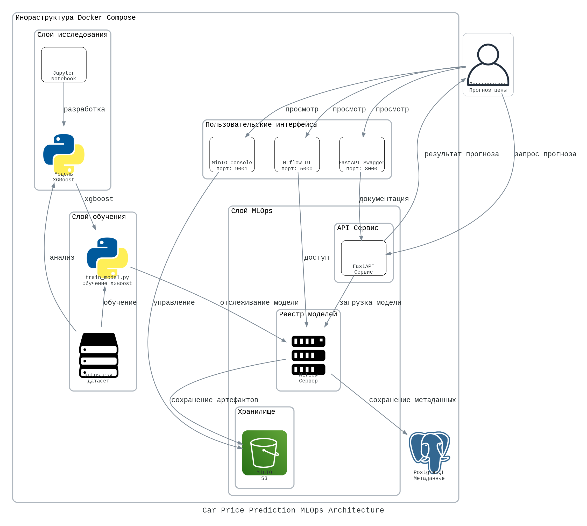

# MLOps для модели прогнозирования стоимости автомобилей

Этот проект представляет полный MLOps-стек для обучения, хранения и развертывания модели машинного обучения для прогнозирования стоимости автомобилей.

[](https://www.python.org/downloads/release/python-390/)
[](https://mlflow.org/)
[](https://fastapi.tiangolo.com/)
[](https://www.docker.com/)
[](https://opensource.org/licenses/MIT)



## Способы запуска

Вы можете выбрать один из двух вариантов запуска проекта:

1. **Запуск из исходного кода** - клонируйте этот репозиторий и запустите с помощью docker-compose (инструкции ниже)
2. **Запуск с помощью Docker Hub** - используйте готовые образы из Docker Hub, [инструкции здесь](README-Docker.md)

## Исследование и моделирование

Модель прогнозирует стоимость автомобилей на основе набора характеристик. Процесс разработки включает:

1. **Предобработка данных**:
   - Очистка данных и удаление дубликатов
   - Преобразование категориальных переменных
   - Фильтрация выбросов по цене и году регистрации

2. **Обучение модели**:
   - Используется алгоритм XGBoost для регрессии
   - Гиперпараметры: max_depth=12, learning_rate=0.15, n_estimators=100
   - Оценка производится по метрике RMSE (Root Mean Square Error)

3. **Сохранение модели**:
   - Модель регистрируется в MLflow для версионирования
   - Артефакты хранятся в MinIO, метаданные в PostgreSQL

## Описание инфраструктуры

Проект включает следующие компоненты:

- **MLFlow** - для трекинга экспериментов и хранения моделей (порт 5000)
- **PostgreSQL** - база данных для хранения метаданных MLFlow (порт 5432)
- **MinIO** - S3-совместимое хранилище для артефактов модели (порт 9000, консоль на порту 9001)
- **FastAPI** - REST API сервис для инференса (порт 8000)

## Необходимые компоненты

- Docker и docker-compose
- Python 3.9+
- Набор данных `autos.csv` (поместите в директорию проекта)

## Структура проекта

```
├── app/                        # Директория с FastAPI приложением
│   ├── __init__.py
│   └── main.py                 # Основной файл FastAPI приложения с моделью предсказания
├── docker-compose.yml          # Конфигурация docker-compose для запуска всех сервисов
├── fastapi.Dockerfile          # Dockerfile для FastAPI сервиса
├── mlflow.Dockerfile           # Dockerfile для MLflow сервера
├── train.Dockerfile            # Dockerfile для обучения модели
├── train_model.py              # Скрипт для обучения и регистрации модели
├── requirements.txt            # Зависимости Python
├── docs/                       # Документация и скриншоты
│   └── img/                    # Скриншоты для документации
├── README.md                   # Основная документация проекта
├── README-Docker.md            # Инструкция по запуску через Docker Hub
├── LICENSE                     # MIT лицензия
├── mlflow/                     # Директория для данных MLflow (создается при запуске)
└── autos.csv                   # Набор данных для обучения модели (необходимо добавить)
```

## Описание файлов проекта

### Основные файлы

- **app/main.py** - FastAPI приложение с REST API для предсказания цен на автомобили. Включает в себя:
  - Загрузку модели из MLflow
  - Предобработку входных данных
  - Обработку запросов на предсказание
  - Валидацию данных через Pydantic
  - Обработку ошибок и логирование

- **train_model.py** - Скрипт для обучения и регистрации модели:
  - Загрузка и очистка данных из CSV-файла
  - Кодирование категориальных признаков
  - Обучение модели XGBoost
  - Логирование метрик и параметров в MLflow
  - Регистрация модели в реестре моделей MLflow

- **docker-compose.yml** - Конфигурация всех сервисов:
  - Настройка PostgreSQL для метаданных MLflow
  - Настройка MinIO для хранения артефактов
  - Настройка MLflow сервера
  - Настройка FastAPI сервиса

- **fastapi.Dockerfile** - Dockerfile для сборки контейнера FastAPI:
  - Установка необходимых библиотек и зависимостей
  - Настройка среды выполнения
  - Копирование кода приложения

- **mlflow.Dockerfile** - Dockerfile для сборки контейнера MLflow:
  - Установка MLflow и зависимостей
  - Настройка соединения с PostgreSQL и MinIO

- **train.Dockerfile** - Dockerfile для сборки контейнера обучения:
  - Установка зависимостей для модели
  - Копирование скрипта обучения

- **requirements.txt** - Список зависимостей Python проекта:
  - fastapi, uvicorn, pydantic - для API
  - pandas, numpy, scikit-learn, xgboost - для обработки данных и моделирования
  - mlflow, boto3 - для взаимодействия с MLflow и MinIO

- **app/__init__.py** - Инициализирующий файл для пакета app.

## Запуск проекта

### 1. Клонируйте репозиторий

```bash
git clone https://github.com/most1ksava/car-price-prediction.git
cd car-price-prediction
```

### 2. Запустите инфраструктуру

```bash
docker-compose up -d
```

Это запустит MLFlow, PostgreSQL, MinIO и FastAPI.

### 3. Скачайте датасет

Скачайте датасет `autos.csv` и поместите его в корневую директорию проекта.

### 4. Обучите и зарегистрируйте модель

```bash
python train_model.py
```

Это обучит модель XGBoost с оптимальными параметрами и зарегистрирует ее в MLFlow.

### 5. Доступ к сервисам

- MLFlow UI: http://localhost:5000
- MinIO Console: http://localhost:9001 (login: minio, password: minio123)
- FastAPI Swagger: http://localhost:8000/docs

## Демонстрация работы

### MLflow UI


### MinIO Console


### FastAPI Swagger


### Предсказание модели


## Использование API

API принимает следующие категориальные признаки:

| Признак | Возможные значения | Описание |
|---------|-------------------|----------|
| vehicle_type | sedan, coupe, suv, wagon, van | Тип кузова автомобиля |
| gearbox | manual, auto | Тип коробки передач |
| fuel_type | petrol, diesel, gas, hybrid, electric | Тип топлива |
| brand | volkswagen, bmw, audi и другие | Марка автомобиля |
| model | golf, passat, 3er и другие | Модель автомобиля |

Числовые признаки:
- registration_year: год регистрации (1900-2023)
- power: мощность в л.с. (>0)
- kilometer: пробег в км (>0)
- repaired: был ли автомобиль в ремонте (0 - не был, 1 - был)

### Тестовые запросы для Windows CMD

#### 1. Проверка статуса сервиса

```cmd
curl -X GET http://localhost:8000/health
```

#### 2. Получение информации о модели

```cmd
curl -X GET http://localhost:8000/model-info
```

#### 3. Предсказание цены автомобиля

```cmd
curl -X POST http://localhost:8000/predict -H "Content-Type: application/json" -d "{\"vehicle_type\": \"sedan\", \"registration_year\": 2010, \"gearbox\": \"auto\", \"power\": 150, \"model\": \"golf\", \"kilometer\": 80000, \"fuel_type\": \"petrol\", \"brand\": \"volkswagen\", \"repaired\": 0}"
```

#### 4. Предсказание для другого автомобиля

```cmd
curl -X POST http://localhost:8000/predict -H "Content-Type: application/json" -d "{\"vehicle_type\": \"suv\", \"registration_year\": 2015, \"gearbox\": \"auto\", \"power\": 200, \"model\": \"x5\", \"kilometer\": 50000, \"fuel_type\": \"diesel\", \"brand\": \"bmw\", \"repaired\": 0}"
```

## MLOps-процесс

1. **Разработка и эксперименты**:
   - Исследование данных и создание признаков
   - Обучение различных моделей с отслеживанием в MLflow

2. **Версионирование моделей**:
   - MLflow автоматически хранит версии моделей
   - Каждая версия содержит параметры, метрики и артефакты

3. **Развертывание**:
   - FastAPI автоматически загружает последнюю версию модели
   - Реализована обработка ошибок и мониторинг

4. **Обновление модели**:
   - Для обновления модели достаточно запустить обучение заново
   - FastAPI автоматически обнаружит новую версию при перезапуске

## Лицензия

Этот проект распространяется под лицензией MIT. Подробности см. в файле [LICENSE](LICENSE).

## Авторы

Сыроваткин Савелий
