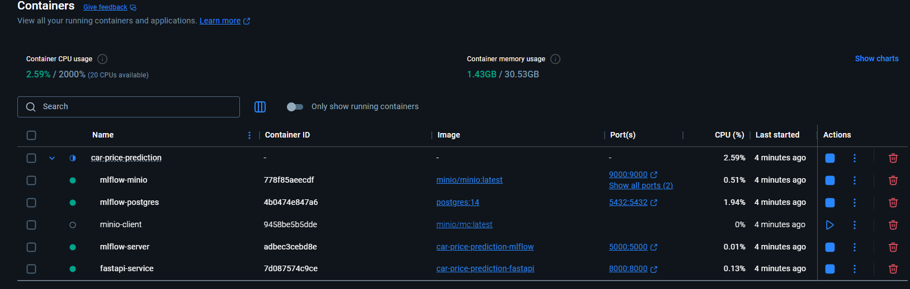

# MLOps для модели прогнозирования стоимости автомобилей

Этот проект представляет полный MLOps-стек для обучения, хранения и развертывания модели машинного обучения для прогнозирования стоимости автомобилей.

[](https://www.python.org/downloads/release/python-390/)
[](https://mlflow.org/)
[](https://fastapi.tiangolo.com/)
[](https://www.docker.com/)
[](https://opensource.org/licenses/MIT)


## Способы запуска

Вы можете выбрать один из двух вариантов запуска проекта:

1. **Запуск из исходного кода** - клонируйте этот репозиторий и запустите с помощью docker-compose (инструкции ниже)

## Исследование и моделирование

Было проведено исследование на данных `autos.csv` [полный блокнот тут](Data_Science_car_price_regressor.ipynb)

Модель прогнозирует стоимость автомобилей на основе набора характеристик. Процесс разработки включает:

1. **Предобработка данных**:
   - Очистка данных и удаление дубликатов
   - Преобразование категориальных переменных
   - Фильтрация выбросов по цене и году регистрации

2. **Обучение модели**:
   - Используется алгоритм XGBoost для регрессии
   - Гиперпараметры: max_depth=12, learning_rate=0.15, n_estimators=100
   - Оценка производится по метрике RMSE 

3. **Сохранение модели**:
   - Модель регистрируется в MLflow для версионирования
   - Артефакты хранятся в MinIO, метаданные в PostgreSQL

4. **Развертывание**:
   - FastAPI автоматически загружает последнюю версию модели
   - Реализована обработка ошибок и мониторинг

5. **Обновление модели**:
   - Для обновления модели достаточно запустить обучение заново
   - FastAPI автоматически обнаружит новую версию при перезапуске

## Описание инфраструктуры

Проект включает следующие компоненты:

- **MLFlow** - для экспериментов и хранения моделей (порт 5000)
- **PostgreSQL** - база данных для хранения метаданных MLFlow (порт 5432)
- **MinIO** - S3-совместимое хранилище для артефактов модели (порт 9000, консоль на порту 9001)
- **FastAPI** - REST API сервис (порт 8000)

## Необходимые компоненты

- Docker и docker-compose
- Python 3.9+
- Набор данных `autos.csv` (поместите и разархивируйте в директории проекта, или поменять на свой)

## Структура проекта

```
-app/ - FastAPI приложение
--init_.py
--main.py - Основной API-сервис с моделью предсказания
-docker-compose.yml - Конфигурация для запуска всех сервисов
-fastapi.Dockerfile - Сборка FastAPI сервиса
-mlflow.Dockerfile - Сборка MLflow сервера
-train_model.py - Обучение и регистрация модели
-extract-autos.py - Рзорхивация с autos.csv с git
-requirements.txt - Зависимости Python
-docs/ - Документы для gti
--img/ - Скриншоты и изображения
-README.md - Описание и инструкции
-LICENSE - MIT лицензия
-mlflow/ - Директория для данных MLflow (создаётся автоматически)
-autos.zip - Датасет для обучения модели
```

## Запуск проекта

### 1. Клонироваитть репозиторий

```bash
git clone https://github.com/most1ksava/car-price-prediction.git
cd car-price-prediction
```

### 2. Запустить инфраструктуру

```bash
docker-compose up -d
```
Это запустит MLFlow, PostgreSQL, MinIO и FastAPI.

### 3. Разархивать датасет или поменять на свой

```bash
python extract-autos.py
```
Это разархивирует датасет `autos.zip`

### 4. Обучить модель

```bash
python train_model.py
```

Это обучит модель XGBoost с оптимальными параметрами и зарегистрирует ее в MLFlow.

### 5. Доступ к сервисам

- MLFlow UI: http://localhost:5000
- MinIO Console: http://localhost:9001 (login: minio, password: minio123)
- FastAPI Swagger: http://localhost:8000/docs

## Демонстрация работы

### Docker-hub


### MLflow UI


### MinIO


### FastAPI Swagger


### Предсказание модели


## Использование API

API принимает следующие категориальные признаки:

| Признак | Возможные значения | Описание |
|---------|-------------------|----------|
| vehicle_type | sedan, coupe, suv, wagon, van | Тип кузова автомобиля |
| gearbox | manual, auto | Тип коробки передач |
| fuel_type | petrol, diesel, gas, hybrid, electric | Тип топлива |
| brand | volkswagen, bmw, audi и другие | Марка автомобиля |
| model | golf, passat, 3er и другие | Модель автомобиля |

Числовые признаки:
- registration_year: год регистрации (1900-2023)
- power: мощность в л.с. (>0)
- kilometer: пробег в км (>0)
- repaired: был ли автомобиль в ремонте (0 - не был, 1 - был)

### Тестовые запросы для Windows CMD

#### 1. Проверка статуса сервиса

```cmd
curl -X GET http://localhost:8000/health
```

#### 2. Получение информации о модели

```cmd
curl -X GET http://localhost:8000/model-info
```

#### 3. Предсказание цены автомобиля

```cmd
curl -X POST http://localhost:8000/predict -H "Content-Type: application/json" -d "{\"vehicle_type\": \"sedan\", \"registration_year\": 2010, \"gearbox\": \"auto\", \"power\": 150, \"model\": \"golf\", \"kilometer\": 80000, \"fuel_type\": \"petrol\", \"brand\": \"volkswagen\", \"repaired\": 0}"
```

#### 4. Предсказание для другого автомобиля

```cmd
curl -X POST http://localhost:8000/predict -H "Content-Type: application/json" -d "{\"vehicle_type\": \"suv\", \"registration_year\": 2015, \"gearbox\": \"auto\", \"power\": 200, \"model\": \"x5\", \"kilometer\": 50000, \"fuel_type\": \"diesel\", \"brand\": \"bmw\", \"repaired\": 0}"
```


## Лицензия

Этот проект распространяется под лицензией MIT. Подробности см. в файле [LICENSE](LICENSE).

## Авторы

Сыроваткин Савелий
